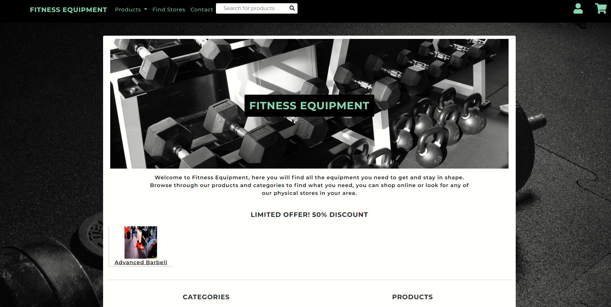
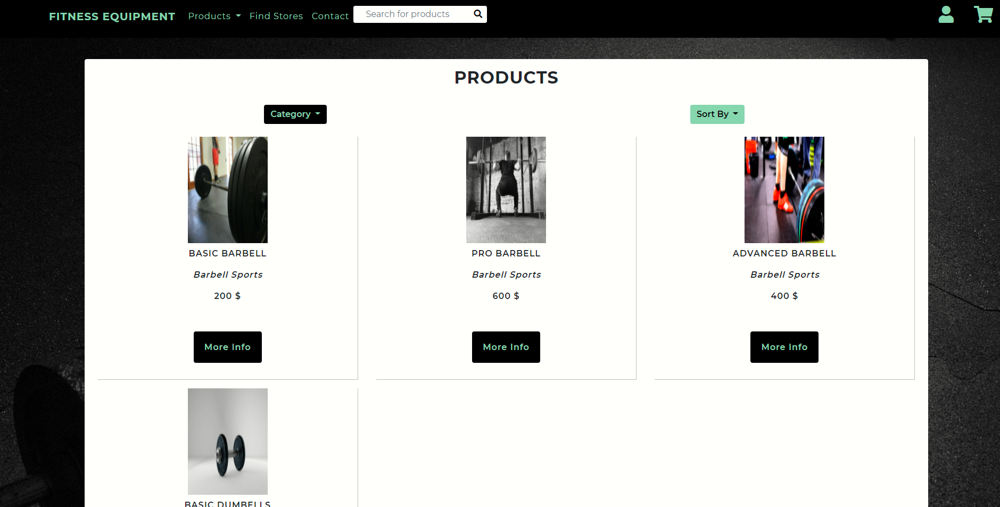
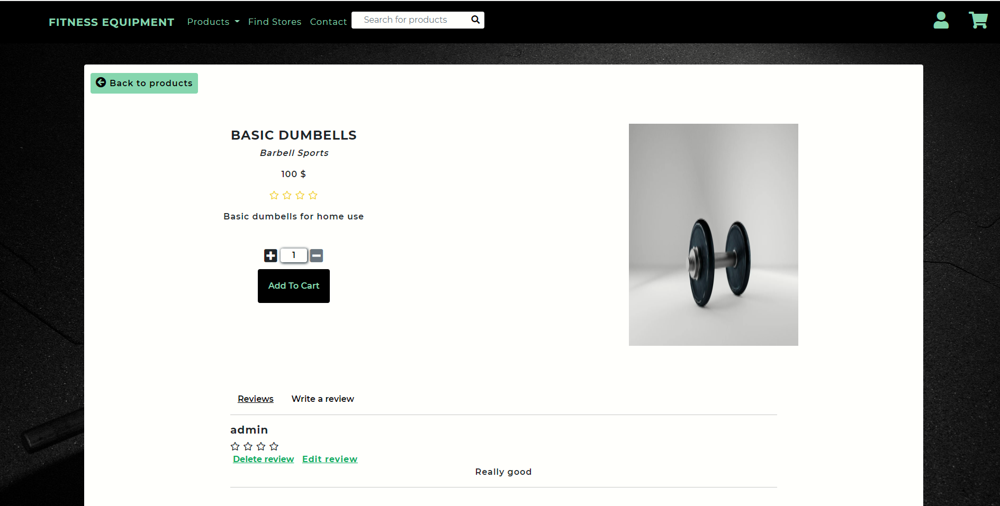
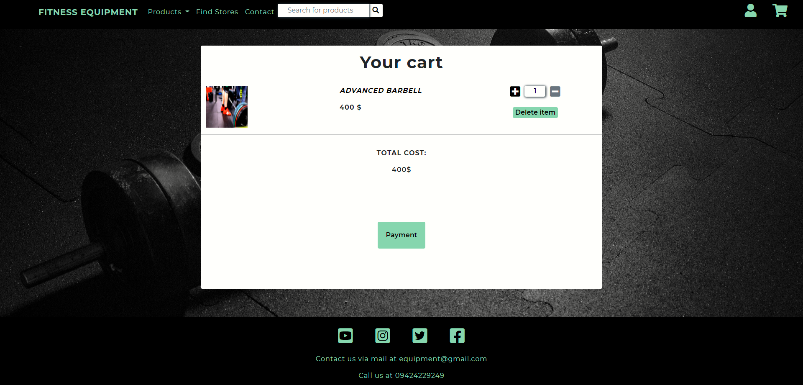

# 

     

This project intends to create a basic (fictional) store that sells fitness equipment both on the web and in physical stores.
By providing the user with the opportunity to purchase relevant equipment through a smooth user experience 
the store looks to attract both new and revisiting customers.

[Link to the deployed project](https://fitness-equipment.herokuapp.com/)

# Table Of Contents

* [UX](#ux)
* [Features](#features)
* [Database](#database)
* [Technologies Used](#technologies-used)
* [Testing](#testing)
* [Deployment](#deployment)
* [Credits](#credits)

## UX

### Overall purpose

The main purpose of the project is to create a fullstack website using the python Django web framework. The site is intended to mimic a 
simple but working site for a company that sells fitness equipment both online and in physical stores. The main targeted customers would
be people looking to buy fitness equipment for home use, which is particularly relevant in the current situation.

### Goal of the developer

The purpose for the developer is to showcase proficiency in working with the Django framework and building an application using the MVC 
pattern. The project includes use of the built in Django authentication system in conjunction with the added Django allauth package for handling
all user authentication. The project includes a fair bit of custom Python, JavaScript and CSS code which intends to showcase proficiency in
those languages. As means of payment the Stripe platform has been integrated in to the project and on the frontend JQuery and Bootstrap has 
been used which displays an ability to work with external libraries.

### Static file hosting

As the size of the project is quite small all custom static files are hosted on the same platform as the Django project itself using the 
WhiteNoise package. In a larger project this would not be advisable and the use of a cloud storage provider such as Amazon's S3 would be 
more appropriate but would also require entering of credit card details as that service is not free of charge after a certain 
threshold.

### Design

The design of the project has been kept fairly simple with a navigation bar in the top and a footer in the bottom which looks the same across 
all pages as well as a main window which looks similar across the pages.

Some inspiration for the design of the site was taken from [Gymgrossisten](https://www.gymgrossisten.com/) ,a swedish company's site who sell supplements and fitness equipment.

The two main colors used are black and a lighter green (#a5d6a7) with a darker green (#4caf50) when hovering over certain elements. The two main colors
provides clear contrast and makes it easy to read and distinguish different elements.

The font chosen for the project is Montserrat with a fallback of sans-serif, the font looks clear yet modern which fits well with the purpose of the site.

### User Stories

#### Regular user 
 
 * As a user I want to easily find relevant equipment so that I can compare and purchase any products I choose.

 * As a user I want to be able to see my current items in my shopping bag/chart and the total prize so that I 
 can keep track of how much I am spending.

 * As a user I want to be able to easily add and remove items from my shopping bag/chart so that I get exactly
 what I want without having to restart the process.

 * As a user I want to be notified before and after any important actions are taken so that I do not accidentally
 perform some unwanted action.

 * As a user I want the navigation on the site to be consistent and easy to understand so that I do not spend 
 unnecessary time trying to access different content.

* As a user I want the checkout and payment process to be clear and fast so that I do not spend time and effort 
on tasks that decrease positive experience of the site.

* As a user I want conformation of any orders and payments so that I can keep track of what I have ordered.

* As a user I want to be able to read reviews and ratings of products from other users so that I can decide
if it is worth buying.

* As a user I want to be able to sign up to save my contact details for an even faster
and smoother checkout and overall user experience.

* As a user I want the sign up process to be fast, smooth and easy to understand so that I quickly get access to
the features provided.

#### Logged in/Signed up user

* When signing up I want to confirm my email address to ensure my email is connected to my account.

* As a logged in user I want to easily be able to edit my profile contact and credit card details incase that
is needed.

* As a logged in user I want to be able to write my own reviews and add ratings on the products on the page.

#### Wireframes and Mockups

The wireframes and mockups are very basic but shows the basic structure and coloring decisions made for the site.
The mockups and wireframes are not very detailed but the general structure of the pages have been kept similar.
A larger exception is the fact that the Stripe checkout was used instead of building a custom checkout page.

* [Wireframe Mobile](static/images/wireframes-mockups/wireframe-mobile.png)
* [Wireframe Tablet](static/images/wireframes-mockups/wireframe-tablet.png)
* [Wireframe Desktop](static/images/wireframes-mockups/wireframe-desktop.png)

* [Mockup Mobile](static/images/wireframes-mockups/mockup-mobile.png)
* [Mockup Tablet](static/images/wireframes-mockups/mockup-tablet.png)
* [Mockup Desktop](static/images/wireframes-mockups/mockup-desktop.png)

## Database

All models and data are stored via relational SQL databases in this project, in development the built in to Django SQlite database will
be used and in production a PostgreSQL database will be used.

The models that will be stored in the database are:

* Order 

* OrderItem

* Store

* Product 

* Category 

* Manufacturer 

* Review 

* UserProfile

### Order fields

* id 
* date
* amount_paid
* shipping_address
* customer_name
* customer_email
* user: foreign key User, optional 

### OrderItem fields

* product: foreign key Product
* order: foreign key Order
* quantity
* discount_rate

### Product fields

* name
* description
* image_url: optional
* category: foreign key Category
* manufacturer: foreign key Manufacturer
* prize
* discount_rate: foreign key Discount, optional
* units_sold 

### Category 

* name
* image_url

### Manufacturer

* name

### Review 

* by_user: foreign key User
* product: foreign key Product
* description
* rating

### Store

* name
* city
* address
* phone_number
* open_hours

### UserProfile

* user: one to one field User
* address
* name

Since all authentication is handle by the the built in Django authentication system and the Django allauth package all models for users are already handled
by default with the only exception of the UserProfile which in essence extends the built in User model.

## Features

### Existing Features

#### Header

* A navigation bar which looks the same across all pages where users can navigate the pages on the site.

* A search bar in where users can search for products.

* Three different dropdowns with links to the products page, account handling and the shopping bag/shopping cart.

#### Footer 

* A footer with social media links and contact information.

#### Index page

* Displaying of discounted products.

* Displaying of different categories of products.

* Displaying of a few randomly selected products.

* Displaying of manufacturers available.

#### Find Stores page

* A list of all stores with all contact details needed.

#### Products page

* A paginated list of products which can be sorted via a dropdown by prize or popularity.

* A dropdown where users can chose to display products based on category.

* Links to the individual products page for each product.

#### Product page

* A button for returning to view all products.

* An input element with buttons where users can add or subtract the quantity of the given product to be added to the shopping bag.

* An add to cart button which leads the user to the shopping cart.

* A section for viewing reviews by other users as well as adding own reviews for users that are registered and logged in.

#### Shopping bag

* Displaying of the current products in the shopping cart.

* An input element with buttons where users can add or subtract quantities of products in the cart.

* A button that links to a Stripe checkout page where users can finalize the payment process.

#### Stripe checkout page

* A checkout page provided by Stripe where users can fill out contact and credit card details to make a payment. For logged in users
the email field will come pre filled with the users primary email to speed up the checkout process.

* Redirects to custom success/error pages after a user has made a purchase.

* Confirmation emails sent to the user after a payment is confirmed and an order is created.

#### Profile page 

* A form for updating contact details.

* Displaying of all previous orders made by that user.

* Links to changing passwords and emails.

#### Django allauth

* All built in features such as signing up, logging in, resetting passwords, changing passwords and verification of email addresses.

* Ability to sign in via Facebook.

### Future Features

* 

## Technologies Used

* HTML

For the basic structure of the web page.

* CSS

For the styling of the HTML elements.

* JavaScript

To add interactivity to the project.

* [Django](https://www.djangoproject.com/)

Django was the backend web framework used to handle all backend processes such as interactions with the
database, authentication and rendering of HTML templates and more.

* [Python](https://www.python.org/)

Custom Python code was written in conjunction with Django to handle all of the backend processes.

* [PostgreSQL](https://www.postgresql.org/)

PostgreSQL was the database used to store all the models in the production environment. All interactions with the database
was handled through the Django Object-Relational Mapper (ORM) and no raw SQL queries where made.

* [SQlite](https://www.sqlite.org/index.html)

The Django preinstalled SQlite database was used as the database in the development environment. As with the production PostgreSQL 
database all interactions where made through the Django ORM.

* [JQuery](https://jquery.com/)

JQuery functions where used to manipulate the DOM, take actions and to make AJAX calls.

* [Bootstrap](https://getbootstrap.com/)

Bootstrap was used to provide structure and responsiveness to the site by using their container
, row, offset and col classes. Helper classes for margin, padding, font weight and text transform such
as their m, p, fw, text-uppercase classes where heavily used throughout the project to speed up the
front end development. A navbar and some dropdown elements where components included in the project.

* [Stripe](https://stripe.com/)

Stripe was used to handle all payments on the site.

* [Heroku](https://id.heroku.com/login)

Heroku was used to deploy and host the project.

* [Github](https://github.com/)

Github was used to store the repository.

* [Gitpod](https://www.gitpod.io/)

Gitpod was the IDE used to create the project.

* [Git](https://git-scm.com/) 

For version control through the Gitpod terminal.

* [Adobe XD](https://www.adobe.com/products/xd.html)

Adobe XD was used to create the wireframes and mockups for the project.

* [Materialize](https://materializecss.com/)

Materialize was not used directly in the project but the colors were chosen by using their color palette.

* [Chrome DevTools](https://developers.google.com/web/tools/chrome-devtools)

Chrome DevTools was heavily used throughout the project,  mainly by debugging and testing with help of the console and
checking the responsiveness of the page with their screen rendering tools.

* http://whatismyscreenresolution.net/multi-screen-test 

For testing the responsiveness across different devices.

## Testing

* The CSS was run through the https://jigsaw.w3.org/css-validator/ without any errors found.

* The HTML was run through the https://validator.w3.org/, the errors that are found are all related to
the Django templating language. Since Django is creating HTML files by using templates and injecting variables
from the backend the validator gives errors that are not actually present at runtime.

* The JavaScript was run through the https://jshint.com/ linter, no errors found. Two warnings occur regarding 
unused variables, these can be ignored since these functions are used and called when submitting forms.

* The cornflakes(flake8) linter was installed as an extension to the development environment and validated
the Python code throughout the project.

* The responsiveness was tested by simulating a vide variety of devices such as phones, tablets and desktops using
the Chrome DevTools and http://whatismyscreenresolution.net/multi-screen-test. The sites look well down to 320 pixels
wide.

* The site was tested on three different browsers: Google Chrome, Mozilla Firefox and Microsoft Edge.

### Manual tests of functions and features 

#### Navigation bar

* Clicking logo link.

**Expected:** The link should take the user to the index page.

**Results:** The link leads the user to the index page, if a user is already on the index page it reloads the page.
***

* Pressing the products link/dropdown and using the links.

**Expected:** Pressing the products link should expand a dropdown with som links. The links that are displayed should be one for all products and
one for each category respectively in the database. The all products link should link to the products page and display all products, the other links
should lead to the products page and display only products from that category.

**Results:** Clicking the products link expands the dropdown, clicking the all products link takes the user to display all products on the products page.
Pressing any of the category links takes the user to the products page and only displays products from that category.
***

* Clicking the find stores link.

**Expected:** The link should take the user to the find stores page where information about all available stores are presented in separate sections.

**Results:** The links leads to the find stores page where all stores and corresponding information is displayed in separate sections.
***

* Clicking the contact link.

**Expected:** The link should scroll down the window to the bottom where the contact information is located. 

**Results:** Clicking the link scrolls down the window and displays the footer where the contact information is located.
***

* Searching for products in the search bar.

**Expected:** Any search should lead to the products page where the search results are displayed. The search should include results 
in the name of the product, in the description of the product as well as the manufacturer. If no results are found a message should display
saying that no results where found.

**Results:** Searching for products leads to the products page, the search query finds and displays matches in the product name, description and
manufacturer fields. When no results are found a text stating that no results were found is displayed.
***

* Clicking the user icon and following the links.

**Expected:** Clicking the icon should expand a modal, if the user is currently logged out the links should be to either log in or sign up. If a 
user is logged in the links should be for account and log out.

**Results:** Clicking the link expands the modal and when the user logged out two links are presented, log in and sign up. When the user is logged in 
two links for account and log out are presented.
***

* Following the user dropdown links.

**Expected:** The log in link should take the user to the log in page, the sign up link should take the user to the sign up page, the account link should lead the user to the profile page and display the current users profile. The log out link should lead the user to the log out page where a user can log out from the account.

**Results:** The log in link leads to the log in page, the sign up link leads to the sign up page, the account link leads to the profile page where the 
current users profile is displayed. The log out link leads to the log out page where a user can log out.
***

* Clicking and following the link in the shopping cart icon.

**Expected:** Clicking the shopping cart should expand a modal, when a user has not yet added anything a text should display that the cart is empty.
If a user has added items to the cart it should display the total cost and a link to view the bag. Clicking that link should lead to the shopping
cart page where all current items are displayed.

**Results:** Clicking the icon expands the modal, when the cart is empty a text displaying the cart is empty is displayed. When the cart has items it
displays the total cost and a link to the shopping cart, clicking the link leads the user to the shopping carts page where all current items are
displayed.
***

#### Footer

* Clicking any of the social media links.

**Expected:** Clicking a icon/link should open the corresponding brands index page in new tab.

**Results:** All links open the corresponding brands index page in a new tab.
***

#### Index page

* Clicking any of the products in the limited offers section.

**Expected:** Clicking a product should take the user to that products page.

**Results:** Clicking on a product leads the user to that specific products page.
***

* Clicking any of the products in the products section.

**Expected:** Clicking a product should take the user to that products page.

**Results:** Clicking on a product leads the user to that specific products page.
***

* Clicking any of categories in the categories section.

**Expected:** Clicking on a category link should lead the user to the products page where the chosen category of products are displayed.

**Results:** Clicking on a category link leads the user to the products page and displays only products of that category.
***

* Clicking any of manufacturers in the manufacturers section.

**Expected:** Clicking a manufacturers link should lead the user to the products page where products of the chosen manufacturer are displayed.

**Results:** Clicking on a manufacturers link leads the user to the products page and displays only products from that manufacturer.
***

#### Products page

* Clicking any of the product names/links.

**Expected:** Clicking a product link should lead the user to that specific products page.

**Results:** Clicking on product link takes the user to that specific product page.
***

* Using the category dropdown.

**Expected:** Clicking the category button/dropdown should expand the dropdown and display all current categories in the database. Clicking any of the
category links should display only products from that chosen category.

**Results:** Clicking the category button expands the modal and displays all categories in the database. Clicking any of the links reloads the products 
page and displays only products from that category.
***

* Using the sort by dropdown.

**Expected:** Clicking the sort by button/dropdown should expand the dropdown and display link to sort by prize and popular. Clicking any of the
category links should reload the products page and display the products in the order of what was chosen. Ordering by prize should order the results
from lowest to highest while ordering by popular should order the items from most sold to least sold.

**Results:** Clicking the sort by button expands the dropdown, two links are displayed: prize and popular. Clicking the prize link reloads the page 
and displays the products in ordering by price from lowest to highest. Clicking the popular link reloads the page and displays the products in 
ordering by units sold from highest to lowest.
***

* Using the pagination buttons.

**Expected:** Pressing the next button should take the user to the next page and display next ten (or less) items. Pressing the previous button should 
take the user to the previous page and display the ten previous product items. Pressing the first button should take the user to the first page and display
the ten first product items, pressing the last button should take the user to the last page and display the last ten (or less) items.

**Results:** Pressing the next button takes the user to the next page and displays the next ten items or less depending upon how many items are in the database. Pressing the previous button takes the user to the previous page and displays the previous ten products. Pressing the first and last buttons 
takes the user to their respective first and last pages.
***

#### Product page

* Increasing/Decreasing the product quantity via the buttons.

**Expected:** Pressing the plus button should increase the quantity up to a max of ten and then the plus button should be disabled. The minus button 
should decrease the product quantity if more than one and when it reaches one the minus button should be disabled.

**Results:** Pressing the plus button increments the quantity by one each time until the quantity is ten, at ten the plus button is disabled. The minus button decrements the quantity by one each click until the quantity is one and at that point the minus button is disabled.
***

* Adding product to the cart.

**Expected:** Pressing the add to cart button should add the product with the given quantity to the bag as long as the total quantity of that specific 
product does not exceed ten. If the added quantity plus the quantity already in the bag of that specific product exceeds ten the bag should only save
a quantity of ten regardless of input.

**Results:** If an item does not exist in the bag pressing the add to cart button with a quantity between one and ten will add that item and quantity to the bag. If an item already exists in the bag the quantity will be updated with the added quantity unless the total quantity exceeds ten and in that case the bag will store a quantity of ten regardless of any more inputs.
***

* Using the review pagination buttons.

**Expected:** Pressing the next button should take the user to the next page and display next five (or less) items. Pressing the previous button should 
take the user to the previous page and display the ten previous product items. Pressing the first button should take the user to the first page and display
the ten first product items, pressing the last button should take the user to the last page and display the last five (or less) items.

**Results:** Pressing the next button takes the user to the next page and displays the next five items or less depending upon how many items are in the database. Pressing the previous button takes the user to the previous page and displays the previous five products. Pressing the first and last buttons 
takes the user to their respective first and last pages.
***

* Submitting a review form

**Expected:**Filling out and submitting the review form as a logged in user should reload the products page, display a success message and add the review
to the product. Leaving out any of the fields should trigger a warning and make the form not submittable.

**Results:** By filling out and submitting the form as a logged in user the product page reloads, a success message is displayed and the review is added to
the database and can be viewed on the page. By leaving out any or all of the fields in the form a warning appears and the form is not submittable.
***

* Pressing the delete review button on a previously made review.

**Expected:** For any previously made reviews by the current logged in user a delete review button should appear under the name of the author of the review.
By pressing the button a warning modal should appear and the user should have the option to either cancel the deletion or delete the review. If the user 
presses cancel the modal should just close and no further actions taken, if a user presses delete the review should be deleted and a success message should display.

**Results:** For every review previously made by the logged in user a button for deleting that review appears, when clicking the button a warning modal
appears where the user either can cancel or actually delete the review. If the cancel button is pressed the modal closes and nothing more happens, if the delete button is pressed the page reloads, the review is deleted and a success message is displayed.
***

### Answering User Stories

#### Regular user 
 
 * *As a user I want to easily find relevant equipment so that I can compare and purchase any products I choose.*
 
 On the index page relevant products, categories, manufacturers and offers are displayed with links so that any visitor 
 quickly can start exploring the products available. A link to the products page is easily found in the header as well
 as a search bar where users can search for any product. Upon entering a single products page ratings and reviews from
 previous customers as well as the prize are immediately presented so that a user quickly can compare the product.

 * *As a user I want to be able to see my current items in my shopping bag/chart and the total prize so that I 
 can keep track of how much I am spending.*

 By clicking the shopping car icon in the top right corner a user can quickly see the total cost for the items added.
 The navigation bar where the cart is located looks the same across all pages which makes finding the cart very easy.

 * *As a user I want to be able to easily add and remove items from my shopping bag/chart so that I get exactly
 what I want without having to restart the process.*

 By clicking the link to view the bag from the shopping cart the user is redirected to the shopping cart page where they
 can add, subtract and remove the items from the bag by pressing a set of self explanatory buttons.

 * *As a user I want to be notified before and after any important actions are taken so that I do not accidentally
 perform some unwanted action.*

 As deleting a previously made review is the most crucial moment which cannot be undone a warning modal displays where a 
 user can confirm their action. 

 * *As a user I want the navigation on the site to be consistent and easy to understand so that I do not spend 
 unnecessary time trying to access different content.*

 The navigation menu looks the same across all pages and are given clear names so that a user understands where they lead.

* *As a user I want the checkout and payment process to be clear and fast so that I do not spend time and effort 
on tasks that decrease positive experience of the site.*

As a logged in user the email will come pre filled in the checkout process which saves a small amount of time.

* *As a user I want conformation of any orders and payments so that I can keep track of what I have ordered.*

Any customer will receive a confirmation email with the relevant information as soon as a payment has been confirmed and 
an order is created. As a logged in user all purchases/orders will be saved and can be accessed from the profile page.

* *As a user I want to be able to read reviews and ratings of products from other users so that I can decide
if it is worth buying.*

Ratings and reviews made by other users can be found on each products own page.

* *As a user I want to be able to sign up to save my contact details for an even faster
and smoother checkout and overall user experience.*

When proceeding to the Stripe checkout payment from the bag logged in users will have the email field pre filled.

* *As a user I want the sign up process to be fast, smooth and easy to understand so that I quickly get access to
the features provided.*

Signing up is easy by entering a username, email address and password and then confirming the email by clicking the link sent. The sign up page is easy to find by clicking the account icon which is located in the header and can be accessed from any page.

#### Logged in/Signed up user

* *When signing up I want to confirm my email address to ensure my email is connected to my account.*

Upon registration all users are sent an email where they must confirm their email address by clicking the link sent in the mail to the email address that was entered when singing up.

* *As a logged in user I want to easily be able to edit my profile contact details incase that
is needed.*

The profile page is easy to find by pressing the user icon and then account. Updating the profile is easy and only requirers a user to update 
the details in the form and then pressing the update button.

* *As a logged in user I want to be able to write my own reviews and add ratings on the products on the page.*

Writing own reviews as a logged in user is easy, by navigating to single products page, scrolling down the page and pressing write a review a form
for submitting a review is displayed. By filling out the form and pressing submit the review is added.

## Deployment

### Publishing the project

The project was deployed on [Heroku](https://dashboard.heroku.com/), the following steps were taken:

1. Created a requirements.txt file by typing: "pip3 freeze --local > requirements.txt" in the terminal.
2. Created a procfile by typing echo web: "web: gunicorn fitness_equipment.wsgi > Procfile" in the terminal.
3. Logged in to Heroku.
4. Pressed the button "new" and then "create new app".
5. Chose an app name and a region and pressed create app.
6. Went to deployment section.
7. Under deployment method pressed Github.
8. Chose the right repository in the list, pressed search and then connect.
9. Pressed enable automatic deploys under automatic deploys.
10. Went to settings.
11. Added all the config vars needed for the project.
12. Pressed open app.

### Setting up Stripe, a PostgreSQL database and general environment variables for forking or cloning the project

The first step after forking or cloning the project would be to install all dependencies needed by the system.
If the project is opened in GitPod the command in the terminal would be: pip3 install -r requirements.txt.
If working locally setting up a virtual environment first be recommended and after that 
running the pip3 install -r requirements.txt command.

In order for the project to work in a product environment a PostgreSQL database would need to be set up, this process might differ 
depending upon how you choose to deploy the site but on Heroku you would:
1. Log in to Heroku.
2. From the dashboard click the link to the app.
3. Go to resources.
4. Click on the find more addons button.
5. Click on the Heroku Postgres button.
6. Click on install Heroku Postgres.
7. Choose the Hobby dev free plan and choose your app in the list.
8. Press submit form.

If your using another way of hosting the project include an environment variable called "DATABASE_URL" which only exists in the production
environment and create the connection to the database in this section in the settings.py file: if DATABASE_URL:
    DATABASES = {
        'default': dj_database_url.parse(DATABASE_URL)
    }

In order for the payment and order system to work a Stripe needs to be set up.

### Forking the project
1. Go to and log in to https://github.com/.
2. Go to the repository: https://github.com/davidlidebrandt/milestone-project-4
3. Press the fork button located on the right side.
4. Make your changes to the project.
5. If you wish to merge your changes to the original project:
6. Press the pull request button from your forked repository.
7. Press the button new pull request.
8. Choose the branches you wish to merge.
9. Press the Create pull request button.

### Cloning the project
There are several ways of cloning the project, here I am going to describe how to do it using
the URL and Git Bash.
1. Go to the repository: https://github.com/davidlidebrandt/milestone-project-4
2. Click the Code button.
3. Choose HTTPS and copy the link that is provided.
4. Open Git Bash and navigate to the directory where you want to save the cloned project.
5. Type git clone followed by the url you copied, git clone https://github.com/davidlidebrandt/milestone-project-3.git

## Credits 

### Content

### Media

Background image came from https://pixabay.com/sv/photos/hantel-idrott-vikter-gym-1966247/ by user Jonas_Fehre.

Favicon image came from https://pixabay.com/sv/vectors/skivst%C3%A5ng-vikt-pump-j%C3%A4rn-fitness-3573104/ by user b0red.

Main image on the index page came from https://pixabay.com/sv/photos/cross-fit-zimmer-h%C3%A4lsa-fitness-1126999/ by user GYMer_Jason 

### Acknowledgments

Thanks to my tutors and my mentor at Code Institute for help throughout the project.